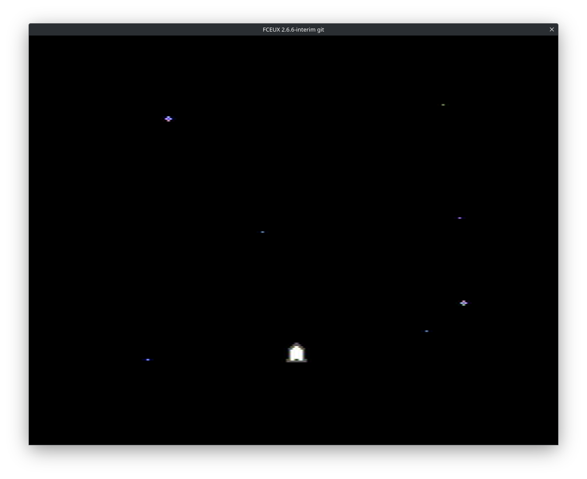
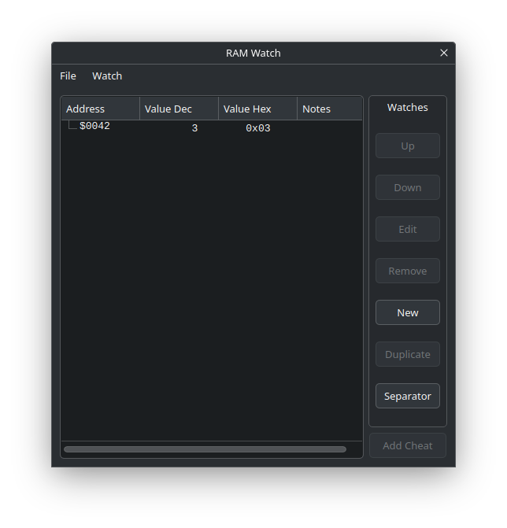
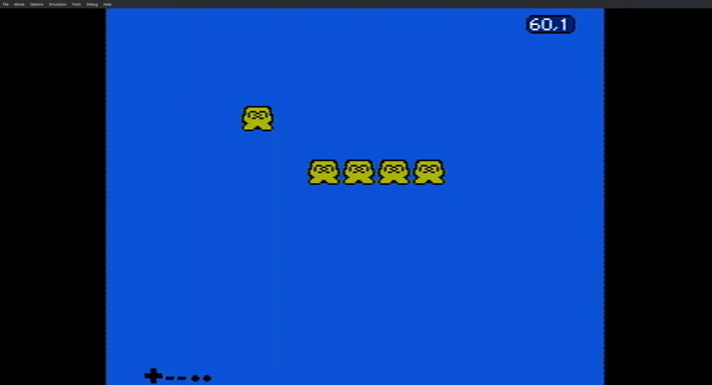
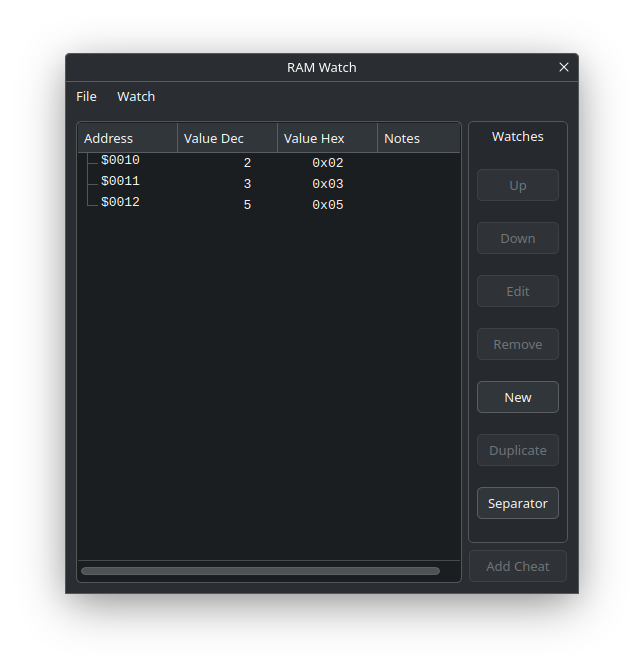

## Showing a sprite and reading from a controller

Here we have simple programs which try to explain a particular topic of NES
programming. They are single files which already contain all you need in order
to have a working program. This means that there is quite a lot of boilerplate
you might not be aware. For this reason I encourage you to start with the
`sprite.s` file, which has a step by step explanation on how the NES is
initialized and what do all these magic "HEADER" and other jargon actually mean.
Thus, read the file thoroughly, and when you build the example you will see the
following:

Now that you know how to show a sprite on screen, let's read a controller. This
is demonstrated with the `input.s` file, but note that a safer and more
comprehensive version of reading from a controller is shown in
[shared/joypad.s](../shared/joypad.s). Read the `input.s` file, but note that
nothing useful will be displayed on screen. Out of simplicity, you are required
to just look at a RAM value. If you do so, just watch on the `$42` memory
address, which contains how many times the right button has been pressed. This
is an example with FCEUX showing a run which has pressed the right button three
times:

We could put these two examples together, and that's the role of the
[space/](../space/) directory.

## Flickering sprites

The NES had a limitation which developers found out pretty quickly: there can
only be 8 sprites on a single scanline. If this is not considered and more than
eight sprites are on a given scanline, those "extra" sprites are going to be
skipped from rendering. This is of course bad, and because of this most games
implemented some logic to avoid it: either by placing sprites in clever ways, or
using background elements as if they were sprites, or, more famously, by
applying a flicker effect.

A dumb flicker effect on the NES is pretty easy to achieve, it's a matter of
mindlessly re-ordering sprites as found on the
[OAM](https://www.nesdev.org/wiki/PPU_OAM). The PPU will respect this order and
thus each sprite will be shown most of the times except for a few frames. To the
human eye this looks like flickering images, and it's a technique which is used
a lot on NES games. A dumb and conservative approach has been implemented in
`flicker.s`, which looks like this:

A more clever way to implement this flickering effect stems from being more
aware about the priorities of your game:

1. Which sprites can never be "flickered"? Such as in this example, it might be
   a good idea to leave the main character out of this flickering technique for
   the player's convenience.
2. Is there a way to lay out the OAM memory in a way in which we always get the
   proper results without having to re-arrange objects on the OAM? Imagine a
   very simple game such as [jetpac.nes](https://git.mssola.com/nes/jetpac.nes),
   in which we know in advance the slots for enemies, bonuses, etc.

## Showing a sprite through CHR-RAM instead of CHR-ROM

Rendering a sprite onto the screen is easy as shown on the `sprite.s` example,
but loading sprites from ROM space might be in some cases not in our interest.
This is a huge topic, covered on the [NESdev
wiki](https://www.nesdev.org/wiki/CHR_ROM_vs._CHR_RAM). That is, some games, for
a handful of very specific reasons, might want to load sprites first from ROM
into RAM, and then only rely on RAM for manipulating and showing sprites on
screen.

The [UNROM](https://www.nesdev.org/wiki/UxROM) chip is possibly one of the first
to ever implement this technique. Moreover, this is also the first chip to ever
implement "bank switching". This is a way to map way more memory than the
original hardware allowed, in which cartridges brought a multiplexer which
selected one memory chip or another depending on the "bank" being selected. So,
to begin with this, I have added the `unrom.s` example, which shows a very basic
way to setup the UNROM chip, and how bank switching can be performed. The end
result for this example has to be shown from the RAM viewer. For example, on
FCEUX we can see:

These are the expected values as described on `unrom.s`. After that, we already
have the foundations for `chr-ram.s`, which will use one of the banks for the
assets, and then upon initialization move it to RAM. The result is the same as
with `sprite.s`, but the goal of this example is to appreciate the technique and
understand when it's useful.

## Persisting memory

Another area explored here is a way to persist data across runs. This was
probably to be achieved via the Famicom Disk System, but once that was scrapped
outside of Japan, a replacement had to be delivered for games built for the Disk
System like 'The Legend of Zelda'. This solution came first in the form of the
MMC1, the first memory mapper to support a memory region where persistence was
guaranteed via a battery included into the cartridge itself.

Again, there's not much to show other than RAM data, but at least FCEUX allows
us to retrieve back the data that was explicitely persisted. That is, after you
run this example, simply check on `$HOME/.fceux/sav/` (or at least that's on
Linux). Hence, just run `hexdump -C $HOME/.fceux/sav/persist.sav`, and that will
print the bytes stored starting from `$6000`. The first two bytes is data
explicitely changed by `persist.s`.
