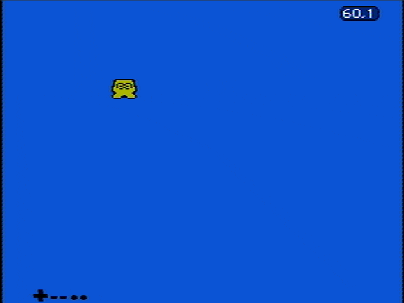

## Effects by bank switching on CHR-ROM

Some games like Megaman 5/6 performed some subtle background effects by
performing bank switching on the PPU thanks to the capabilities of the MMC3.
That is, the trick is to devote at least two similar 1KB chunks where one
contains a subtly changed version of the other. This way, you can simply perform
a periodic bank switch and the PPU will render subtly different things every
time, without the CPU having to dedicate any resources on changing any values on
the data.

A very simple example is provided in [blink.s](./blink.s) where a character
blinks periodically.

