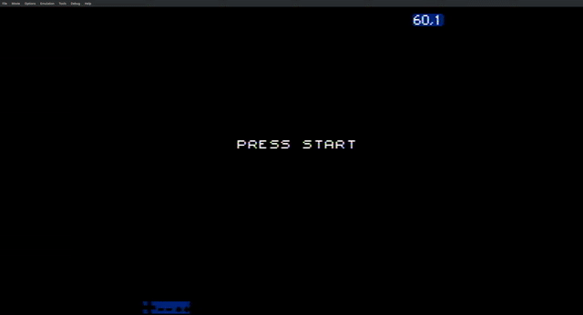

## Generating pseudo-random numbers

Usually there is a requirement from NES/Famicom games to have access to random
numbers. This is not entirely possible on the NES/Famicom since there is no
hardware-specific implementation for any of this (i.e. as it happens on modern
CPUs). But there's this common saying: if you can't make it, fake it! That's a
common mentality when programming on the NES/Famicom due to its shortcomings in
comparison to modern hardware.

In this case, there are quite clever algorithms for generating **pseudo** random
numbers. That is, numbers which are not absolutely random, but they are quite
close to it.

First of all, you need to generate a **seed**: from which number you start
generating new random numbers. The approach taken here is the same as in many
other games: the player is presented with a `Start` screen. On `nmi` code we
count the frames until the player actually presses the `Start` button.
Obviously, this is not really random, but unless you are on a TAS or you are an
amazing player with frame-perfect input skills, it's good enough.

All of this is implemented on the [rand.s](./rand.s) file. After the "Start"
screen the player is presented with the algorithm being used and the random
value that we got. The player can then press `Select` to change the algorithm
being used, or press `A` to select a new number. There are a total of two PRNG
algorithms being tested here:

- [linear.s](./linear.s): A Galois linear feedback shift register (16-bit).
- [precalc.s](./precalc.s): Indexing a pre-computed set of random numbers.

These algorithms are better explained at the top comment from their respective
files. All in all, we get the following result:

