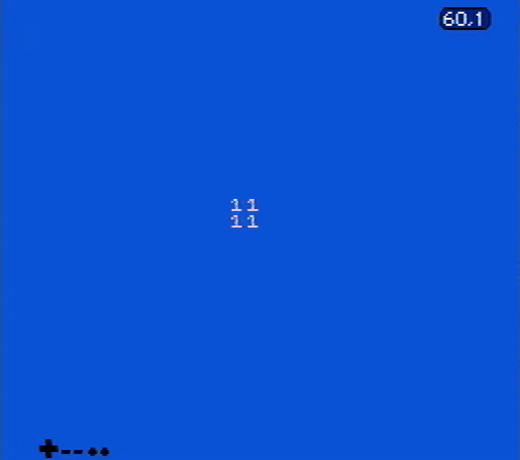
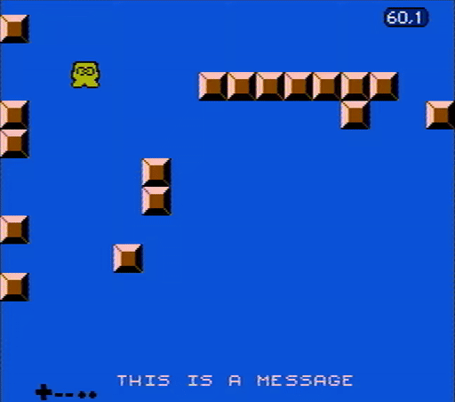

## A primer to scrolling

Scrolling is a big topic and it's something that evolved with the NES/Famicom
hardware. These set of examples try to cover it as much as possible while being
approachable. But before diving into some more realistic examples, let's first
try to understand the concept of scrolling in NES/Famicom programming.

Scrolling at its most simple terms can be read at [toggle.s](./toggle.s), which
gives you this as a result:

    

That is, we only have filled the two nametables available in a vertical
mirroring scenario, and we are modifying the [PPU scroll
register](https://www.nesdev.org/wiki/PPU_registers#PPUSCROLL) to move between
one or the other. Another important note, easily missed when programming
scrolling on the NES/Famicom for the first time, is that whenever the PPU scroll
"wraps around" between two different nametables, you should also update the base
nametable address from the [PPU control
register](https://www.nesdev.org/wiki/PPU_registers#PPUCTRL). That happens in
two cases:

1. If you are scrolling right and PPU scroll turns into `$00`, then it means
   that there's nothing else to show from the origin nametable, and that `$00`
   on the scroll means it's `$00` relative to a new nametable.
2. If you are scrolling left and the PPU scroll turns into `$FF` (i.e. the first
   step when scrolling left), then the base nametable address has to be updated
   because it's `$FF` from the point of view of the nametable from the left.

It's easy to miss these points, but from a PPU perspective (and hence from the
perspective of a programmer interfacing with the PPU), it really makes sense.
All in all, the scroll register is relative to whatever base nametable is set on
the control register. Note that games that scrolled diagonally like Super Mario
Bros. 3 and Kirby's Adventure did not need to do this, since they were
constantly wrapping on the same nametable. This is a more advanced topic, but it
boils down to:

1. Setup horizontal mirroring so we can scroll vertically (i.e. contrary to the
   rest of examples from here).
2. Mask out the leftmost 8 pixels (see bit 2 in the [PPU Mask
   register](https://www.nesdev.org/wiki/PPU_registers#PPUMASK)).
3. The "next" column will be put on the first one, which is always hidden by
   step 2 and will only be visible when moving the PPU scroll register.

Coming back to this first example, though, the approach being used here looks
rather simplistic. That being said, some games used this technique. For example,
in Dropzone it was used to perform some effects on the title screen. Hence,
performing a simple scroll between two nametables is not just for learning
purposes, it was also used in real life games.

## Scrolling multiple screens to the right

With the basics covered, now let's see how a game can scroll past two screens
worth of data. This is delivered on the [level.s](./level.s) example, and
pressing "Select" allows you to toggle between different "levels". This gives
you the following results:

    

This is all accomplished by dropping the notion of tiles and speaking in
"metatile" terms. That is, instead of dividing the screen in 8x8 pixels, we go
up to 16x16 pixel blocks. These blocks are the ones being continuously loaded
when the player moves, and they are the ones being considered for collision
checks. This is all better explained and with all the gory details inside of the
[./include](./include) directory, which is somewhat of a library/engine for the
rest of the scrolling examples. The concepts at display here are more complex
than they look, so take your time reading through the code on
[./include](./include).

Also note that different games had different ways on how to handle metatiles, so
don't go out from these examples thinking "oh, so this is how *all* games mapped
things on screen!". This is just one way to do so, every game came with its own
engine and with its own quirks. Consider, for example, how Megaman games had
"meta-metatiles" (a concept also used in modern games like [Micro
Mages](https://youtu.be/ZWQ0591PAxM?si=kE69LfgpaW6t-Sr3)).

Last but not least, bear in mind that this "[engine](./include)" comes with some
big limitations, like the inability to scroll to the left.

## Detecting collision on sprite 0

Another limitation from the `level.s` example is that *everything* scrolls. This
would be a bummer for most games from the era since they would've wanted to
reserve some space on screen to show the HUD: a section at the top of the screen
where the game shows how many lifes you have, score, etc.

In games like Super Marios Bros. or Punch-out, this was achieved thanks to the
"sprite 0 hit" detection, which was a special feature from the PPU in which it
would flip a bit on the [PPU status
register](https://www.nesdev.org/wiki/PPU_registers#PPUSTATUS) whenever a
background element was found to collide with the first sprite in
[OAM](https://www.nesdev.org/wiki/PPU_OAM). That being said, both the sprite and
the background element need to be opaque (that is, not using the first color
from the palette), and there shouldn't be in a special scenario like the PPU
being disabled or the sprite being on a hidden margin.

Because all of this, both Super Mario Bros. and Punch-out (and many other
games), place the first sprite inside of a background element being displayed
from the HUD. This way, the sprite was not apparent to the player but the PPU
would detect it anyways (and in Super Mario Bros., as a bonus, it would serve as
subtle coin graphical effect). The same technique has been implemented in
[sprite0.s](./sprite0.s), which uses the same engine as `level.s`, but this time
the code on `nmi` has been modified to watch out for sprite 0 collision. This
gives us this result:

    

## Bringing the status bar down below

That being said, the sprite 0 hit detection technique is quite hacky, but more
than that it is a waste of CPU resources: the CPU is spending a lot of time just
waiting for this hit to happen instead of preparing for the next frame. That is,
the CPU is wasting a lot of time constantly polling for some scanline.

Fortunately, some later mapper chips (see examples on [basics/](../basics/) to
understand what these are) like the [MMC3](https://www.nesdev.org/wiki/MMC3)
provided methods for setting up an IRQ for a needed scanline. That is, the CPU,
instead of constantly polling to detect whenever a given scanline was hit, could
just tell the PPU "hey, just tell me whenever you reach this given scanline";
and the PPU would send an IRQ on that condition. This way, the CPU could devote
its resources to compute the next frame, and then, halfway computing the next
frame, it would stop this task to fulfill an IRQ sent by the PPU, resuming
shortly after. This is a much better usage of CPU time, and it could be done
multiple times per frame. Thus, it is a technique that allowed for intricate
effects, as it is shown by parallax effects in Ninja Gaiden II, or roulette-like
minigames as in Super Mario Bros. 3.

In [mmc3.s](./mmc3.s) we go for the most basic usage of this technique: let the
scroll go on as usual, and then on a given scanline we will reset the scroll
back to 0. This will allow us to show a "status bar", which is basically the
same "This is a message" thing from the `sprite0.s` example. This looks
something like this:

    

## Scrolling in different ways in the same frame

As explained above, chips like the MMC3 give programmers a lot of flexibility
when it comes to mid-frame customization. That is, chips like the MMC3 give an
interface in which programmers can ask the chip to submit an IRQ on a given
exact scanline, multiple times per frame. The main usage for this technique is
the one explored above in `mmc3.s`, but these chips allow for a lot of
flexibility, so programmers can get playful with it. One simple example is the
roulette mini-game from Super Mario Bros. 3. In here the game asks for two
scanline IRQs and then the scroll direction is changed on each given IRQ. This
way, the background is split in three sections that move in different
directions/speed. Something similar (but more simple) has been reproduced in
[roulette.s](./roulette.s), giving the following result:

    

