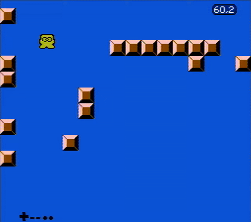
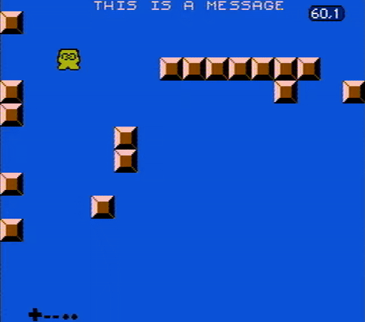
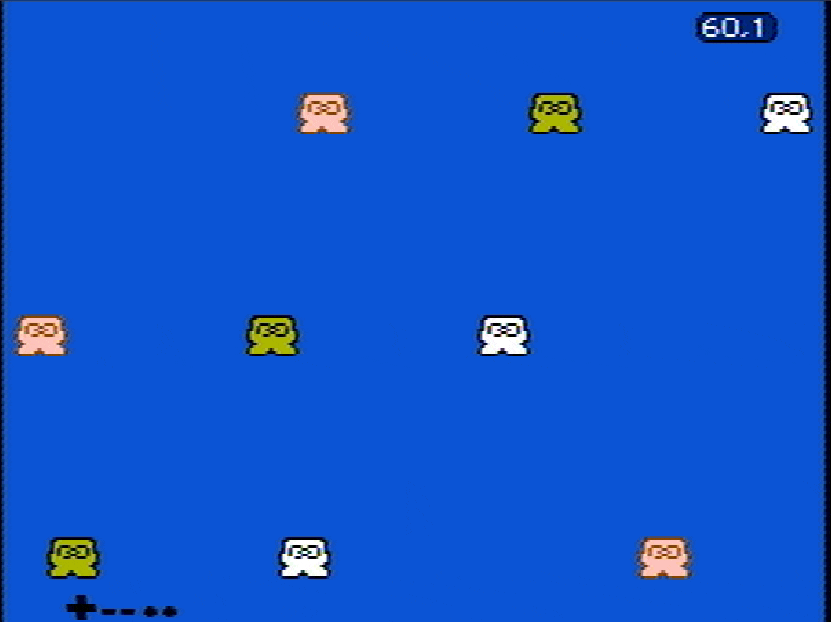

## A primer to scrolling

Scrolling is a big topic and it's something that evolved with the NES hardware.
These set of examples try to cover it as much as possible while being
approachable. But before diving into some more realistic examples, let's first
try to understand the concept of scrolling in NES/Famicom programming.

The very basic concepts of scrolling can be seen in [toggle.s](./toggle.s),
which gives you this as a result:

TBD

That is, we only have filled the two nametable available, and we are modifying
the [PPU scroll register](https://www.nesdev.org/wiki/PPU_registers#PPUSCROLL)
to move between one or the other.

This looks rather simplistic but some games used this technique. For example, in
Dropzone it was used to perform some effects on the title screen. Hence,
performing a simple scroll between two nametables is not just for learning
purposes, it was also used in real life games.

## Scrolling multiple screens to the right

With the basics covered, now let's see how a game can scroll past two screens
worth of data. This is delivered on the [level.s](./level.s) example, and
pressing "Select" allows you to toggle between different "levels". This gives
you the following results:

    

This is all accomplished by dropping the notion of tiles and speaking in
"metatile" terms. That is, instead of dividing the screen in 8x8 pixels, we go
up to 16x16 pixel blocks. These blocks are the ones being continuously loaded
when the player moves, and they are the ones being considered for collision
checks. This is all better explained and with all the gory details inside of the
[./include](./include) directory, which is somewhat of a library for the rest of
the scrolling examples. The concepts at display here are more complex than they
look, so take your time.

Also note that different games had different ways on how to handle metatiles, so
don't go out from these examples thinking "oh, so this is how *all* games mapped
things on screen!". This is just one way to do so, every game came with its own
engine and with its own quirks. Consider, for example, how Megaman games had
"meta-metatiles" (a concept also used in modern games like [Micro
Mages](https://youtu.be/ZWQ0591PAxM?si=kE69LfgpaW6t-Sr3)).

Last but not least, bear in mind that this "[engine](./include)" comes with some
big limitations, like the inability to scroll to the left.

## Detecting collision on sprite 0

Another limitation from the `level.s` example is that *everything* scrolls. This
would be a bummer for most games from the era since they would've wanted to
reserve some space on screen to show the HUD: a section at the top of the screen
where the game shows how many lifes you have, score, etc.

In games like Super Marios Bros. or Punch-out, this was achieved thanks to the
"sprite 0 hit" detection, which was a special feature from the PPU in which it
would flip a bit on the [PPU status
register](https://www.nesdev.org/wiki/PPU_registers#PPUSTATUS) whenever a
background element was found to collide with the first sprite in OAM. That being
said, both the sprite and the background element need to be opaque (that is, not
using the first color from the palette), and there shouldn't be in a special
scenario like the PPU being disabled or the sprite being on a hidden margin.

Because all of this, both Super Mario Bros. and Punch-out (and many other
games), hid the first sprite to have the same color as the last background
element being displayed from the HUD. This way, the sprite was not apparent to
the player but the PPU would detect it anyways. This has also been done on
[sprite0.s](./sprite0.s), which uses the same engine as `level.s`, but this time
the code on `nmi` has been modified to watch out for sprite 0 collision. This
gives us this result:

    

## Bringing the status bar down below

TBD: see also explanation below

## Scrolling in different ways in the same frame

Some chips like the MMC3 give programmers a lot of flexibility when it comes to
mid-frame customization. That is, chips like the MMC3 give an interface in which
programmers can ask the chip to submit an IRQ on a given exact scanline. One
main usage of this was to allow a top section of the screen to scroll, while
leaving a small section at the bottom not to scroll. This way, games were no
longer required to have a status bar at the top and they could have it at the
bottom. But these chips allow for a lot of flexibility, so programmers can get
playful with it. One simple example is the roulette mini-game from Super Mario
Bros. 3. In here the game asks for two scanline IRQs and then the scroll
direction is changed on each given IRQ. This way, the background is split in
three sections that move in different directions/speed. Something similar (but
more simple) has been reproduced in [roulette.s](./roulette.s), giving the
following result:

    

## Expanding to have multiple scrolling directions

TBD: toggle4.s
