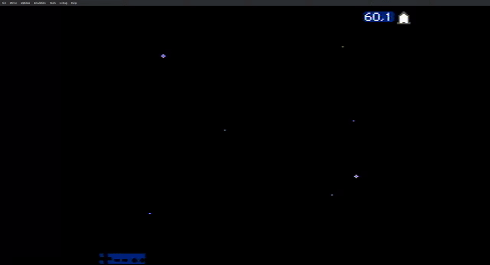

## Space

This is an evolution from the `basics/sprite.s` and `basics/input.s` examples.
That is, we are no longer just showing a sprite, but we also allow the player to
move it and shoot bullets according to the player's input.

The movement is done by taking into consideration subpixels. For this, I have
taken most of the code/idea from [NES
Hacker](https://github.com/NesHacker/PlatformerMovement). Thus, this part is
mostly attributed to him.

